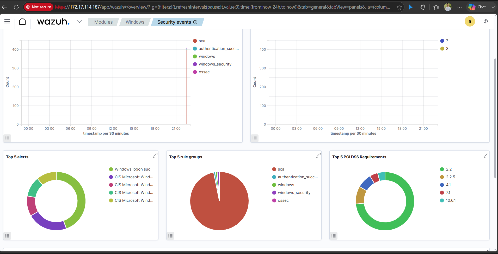
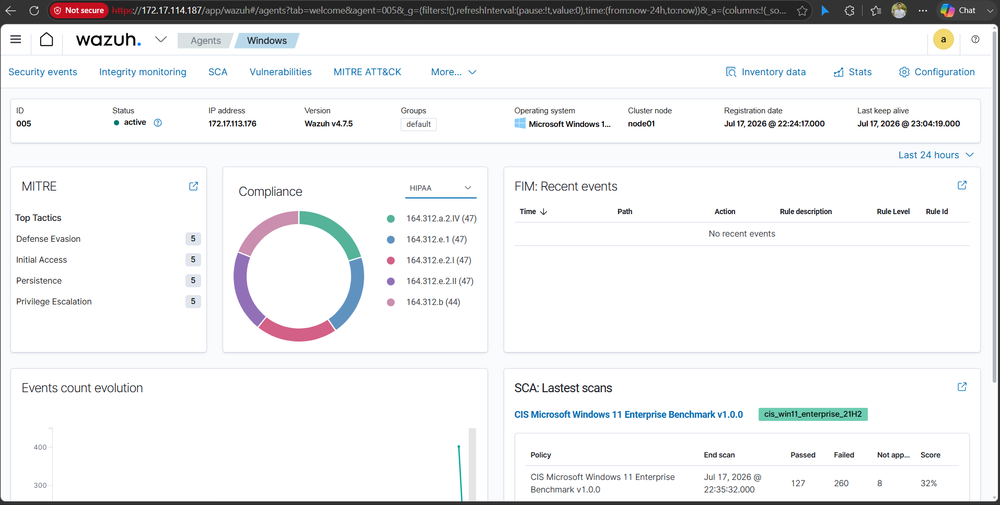
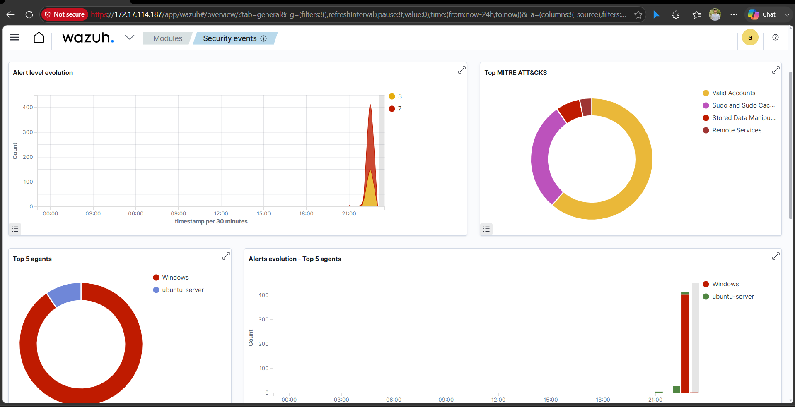
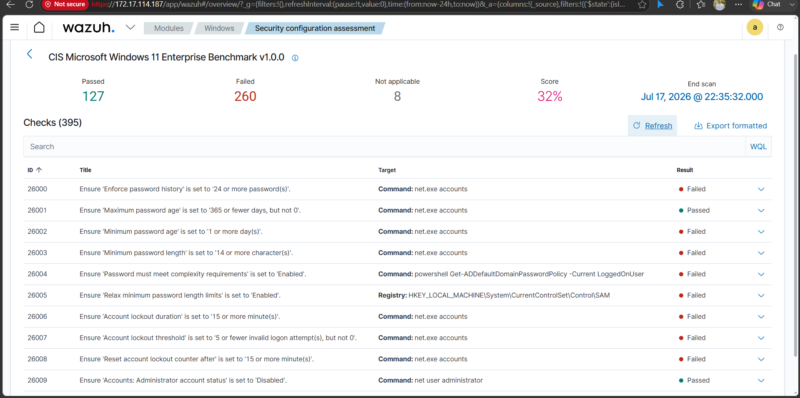

<div align="center">

# 🛡️ Wazuh Security Monitoring Lab

### Threat Modelling and Security Monitoring Sessional (SEC 204)

<p align="center">

</p>

Deploying and monitoring a **Windows 11 Endpoint** using **Wazuh SIEM**, including **Threat Detection**, **Security Configuration Assessment (SCA)**, **MITRE ATT&CK Mapping**, and **Compliance Monitoring**.

<p>


</p>

---

### 📑 Navigation

[Overview](#-overview) •
[Architecture](#-architecture) •
[Screenshots](#-dashboard-preview) •
[Features](#-features) •
[Setup](#-setup-guide) •
[Learning](#-learning-outcomes)

</div>

---

# 📖 Overview

This repository documents my hands-on experience with **Wazuh SIEM** completed during the **Threat Modelling and Security Monitoring Sessional (SEC 204)** course.

The objective was to deploy a SIEM platform, onboard a Windows endpoint, monitor security events, evaluate security configurations using the **CIS Benchmark**, and understand how SIEM solutions assist Security Operations Centers (SOCs) in detecting threats and improving endpoint security.

---

# 🏗️ Architecture

```text
                     Internet
                         │
                         │
        ┌────────────────────────────────┐
        │        Ubuntu Server           │
        │                                │
        │  • Wazuh Manager               │
        │  • Wazuh Dashboard             │
        │  • Wazuh Indexer               │
        └───────────────▲────────────────┘
                        │
                 Secure Communication
                        │
        ┌───────────────┴────────────────┐
        │        Windows 11              │
        │                                │
        │ • Wazuh Agent                  │
        │ • Event Logs                   │
        │ • FIM                          │
        │ • SCA                          │
        └────────────────────────────────┘
```

---

# 📊 Dashboard Preview

## 🖥️ Security Events Overview

<p align="center">

</p>

---

## 🛡️ Windows Agent Dashboard

<p align="center">

</p>

---

## 📈 Security Analytics

<p align="center">

</p>

---

## ✅ Security Configuration Assessment

<p align="center">

</p>

---

# 📊 Assessment Results

| Metric | Result |
|:------|-------:|
| Total Checks | **395** |
| Passed | **127** |
| Failed | **260** |
| Not Applicable | **8** |
| Compliance Score | **32%** |

---

# ✨ Features

- ✅ Windows Endpoint Monitoring
- ✅ Real-time Security Event Collection
- ✅ MITRE ATT&CK Mapping
- ✅ Security Configuration Assessment
- ✅ Compliance Monitoring
- ✅ File Integrity Monitoring
- ✅ Security Analytics Dashboard
- ✅ Security Event Investigation

---

# 🛠️ Technology Stack

| Category | Technology |
|-----------|------------|
| SIEM | Wazuh |
| Operating System | Ubuntu Server |
| Endpoint | Windows 11 Enterprise |
| Agent | Wazuh Agent |
| Compliance | PCI DSS, HIPAA |
| Framework | MITRE ATT&CK |
| Benchmark | CIS Windows 11 Enterprise |

---

# 🚀 Setup Guide

<details>

<summary><b>1️⃣ Install Wazuh Server</b></summary>

Install:

- Wazuh Manager
- Wazuh Dashboard
- Wazuh Indexer

Verify services:

```bash
sudo systemctl status wazuh-manager
sudo systemctl status wazuh-indexer
sudo systemctl status wazuh-dashboard
```

</details>

<details>

<summary><b>2️⃣ Install Windows Agent</b></summary>

Install the Wazuh Agent on Windows.

Configure:

- Manager IP
- Agent Name

Restart the service after installation.

</details>

<details>

<summary><b>3️⃣ Register Agent</b></summary>

Ubuntu:

```bash
sudo /var/ossec/bin/manage_agents
```

Import the authentication key into Windows.

Restart the Wazuh Agent.

</details>

<details>

<summary><b>4️⃣ Verify Connection</b></summary>

```bash
sudo /var/ossec/bin/agent_control -l
```

Expected:

```
Agent ID: 001
Status: Active
```

</details>

<details>

<summary><b>5️⃣ Enable Monitoring</b></summary>

Configure:

- Security Events
- File Integrity Monitoring
- Rootcheck
- Security Configuration Assessment

Restart:

```bash
sudo systemctl restart wazuh-manager
```

</details>

---

# 📚 Learning Outcomes

After completing this lab, I gained practical experience in:

- Deploying a SIEM platform
- Windows Endpoint Monitoring
- Security Event Analysis
- Security Configuration Assessment (SCA)
- MITRE ATT&CK Framework
- Compliance Monitoring
- File Integrity Monitoring (FIM)
- SOC Workflow
- Threat Detection
- Blue Team Operations

---

# 📂 Repository Structure

```text
wazuh-security-monitoring-lab/
│
├── README.md
├── LICENSE
├── screenshots/
│   ├── banner.png
│   ├── security-events-overview.png
│   ├── windows-agent-dashboard.png
│   ├── security-events-dashboard.png
│   └── sca-results.png
│
├── docs/
│   ├── installation.md
│   ├── setup.md
│   └── sca-analysis.md
│
├── reports/
│   └── Security_Assessment_Report.pdf
│
└── assets/
```

---

# 🎓 Course Information

| Item | Details |
|------|---------|
| Course | Threat Modelling and Security Monitoring Sessional |
| Course Code | SEC 204 |
| Program | B.Sc. in Cyber Security Engineering |

---

# 🚀 Future Improvements

- Sysmon Integration
- Active Response
- Sigma Detection Rules
- Custom Detection Rules
- Multi-Agent Monitoring
- Email Notifications
- Threat Hunting Dashboard
- Malware Detection

---

# 👨‍💻 Author

**Abu Sufian**

Cyber Security Engineering Student

University of Frontier Technology Bangladesh

🔗 LinkedIn: *Add your LinkedIn URL*

🐙 GitHub: *https://github.com/YOUR_USERNAME*

---

<div align="center">

### ⭐ If you found this repository useful, consider starring it!

**Learning • Building • Defending**

</div>
